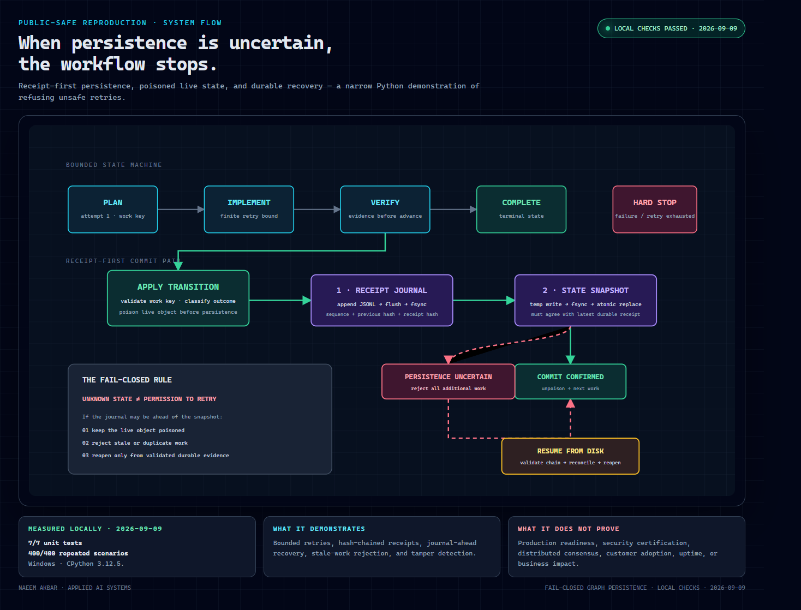

# Fail-closed graph persistence — runnable reproduction

This public-safe, standard-library Python package demonstrates one fail-closed persistence pattern: **when a durable receipt may be ahead of the state snapshot, the live object refuses more work until it is reopened from durable evidence**.

It is a standalone reproduction. It does not call a model, execute tools, access a network, contain provider configuration, or claim production security.



The visualization follows the actual commit order: apply a validated transition, append and sync the hash-chained receipt, then atomically replace the snapshot. An uncertain snapshot write leaves the live object poisoned until durable evidence is validated and reopened.

## Run

Requires Python 3.11+ and no third-party packages.

```bash
python -m unittest -v test_graph_demo.py
python -m unittest -v comparisons/test_recovery_contract.py
python evaluate.py --iterations 100 --output EVALUATION_RESULTS.json
python verify_release.py --iterations 100 --output VERIFICATION_RECEIPT.audit.json
python -m unittest -v test_verifier_guards.py
```

Run these commands from this directory. A successful evaluation exits `0`; any failed scenario exits `1` and appears in the `failures` array.

For a one-command independent readback, run `verify_release.py`. It compiles every Python file, requires the expected seven-test report and twelve-test comparative contract report, runs all four evaluation scenarios, and writes a privacy-safe receipt with file hashes and the reviewer environment. A passing receipt validates only that checkout on that environment; it is not a signature or security certification. A failed run also writes a receipt with `passed: false`; release automation must inspect that field and the process exit code and must regenerate a green canonical receipt immediately before publication. The separate two-test guard suite mutates clean temporary copies and requires a structured failed receipt—not merely a crashed process—when tampered-receipt acceptance or a failed scenario is introduced; it is deliberately not included in the expected seven behavioral tests, avoiding recursive verifier execution.

## Agent harness comparison

`comparisons/` maps this fail-closed external-effect contract onto LangGraph, OpenAI Agents SDK, CrewAI Flows, AutoGen AgentChat, and Pydantic AI durable execution. It includes an official-source capability matrix, implementation sketches, and an executable framework-neutral trace validator.

The comparison separates native checkpointing, state persistence, replay, and human approval from application-level guarantees such as stable action identity, provider reconciliation after timeouts, and refusal to retry an ambiguous external effect. It does not test or certify the upstream frameworks.

## Evaluation matrix

| Scenario | Expected invariant |
|---|---|
| Success path | `plan → implement → verify → complete` produces three hash-chained receipts. |
| Retry bound | Two retryable failures with `max_attempts=2` end in `hard_stop`; no third attempt is issued. |
| Journal-ahead recovery | An injected snapshot failure poisons the live object; reopen advances from the durable receipt. |
| Tamper rejection | Editing a persisted receipt causes resume to reject the journal. |

`evaluate.py` runs each scenario repeatedly in fresh temporary directories and records totals plus SHA-256 hashes of the implementation and unit-test files.

## Design boundary

The journal is append-and-fsync first; the snapshot is written to a temporary file, fsynced, and atomically replaced. Receipt hashes make unkeyed edits evident when later records or the snapshot retain the prior hash. This does **not** defend against an attacker who can coherently rewrite the journal and snapshot; a keyed or external anchor would be required for that threat model.

The artifact also does not prove:

- the safety of any model, provider sandbox, process runner, or production system;
- multi-process locking or distributed consensus;
- immunity to storage hardware or filesystem defects;
- customer adoption, uptime, revenue, or productivity impact.

## Files

- `graph_demo.py` — bounded graph and persistence implementation.
- `test_graph_demo.py` — seven focused unit tests.
- `evaluate.py` — four-scenario repeated evaluation harness.
- `EVALUATION_RESULTS.json` — generated result from the latest verified run.
- `verify_release.py` and `VERIFICATION_RECEIPT.json` — one-command verification and the latest local receipt.
- `test_verifier_guards.py` — two black-box mutation tests for verifier fail-closed behavior.
- `comparisons/README.md` — cited implementation mappings for nine agent harnesses, including Hermes Agent, Pi Agent, NVIDIA NeMo Agent Toolkit, and DeepSeek Harness.
- `comparisons/framework_matrix.json` — machine-readable native-capability and application-gap matrix.
- `comparisons/recovery_contract.py` and `comparisons/test_recovery_contract.py` — framework-neutral contract validator and twelve synthetic tests.
- `docs/CRASH_CONSISTENCY_REVIEW_RUBRIC.md` — in-scope invariants, five crash windows, counterexample prompts, and verdict rules.
- `docs/FRESH_CLONE_REVIEW_INTAKE.md` — clean-room instructions, consent fields, confusion log, and defect template.
- `docs/RECEIPT_INTERPRETATION.md` — field-by-field receipt claims and limitations.
- `.github/workflows/test.yml` — nine-job CI matrix across Python 3.11–3.13 on Linux, Windows, and macOS.
- `SECURITY.md`, `CHANGELOG.md`, and `LICENSE` — release boundaries and repository hygiene.
- `RELEASE_CHECKLIST.md` — approval-gated publication and readback procedure.

## License

MIT. See `LICENSE`.

## External validation plan

Publication remains owner-gated. After approval, the strongest next validation is a small public repository with CI on Windows, Linux, and macOS, followed by two independent reviews: one correctness review focused on crash consistency and one usability review where an engineer runs `verify_release.py` from a fresh clone without assistance. Preserve the returned receipt and the reviewer's findings; record identity only with permission and do not reduce feedback to a testimonial.
